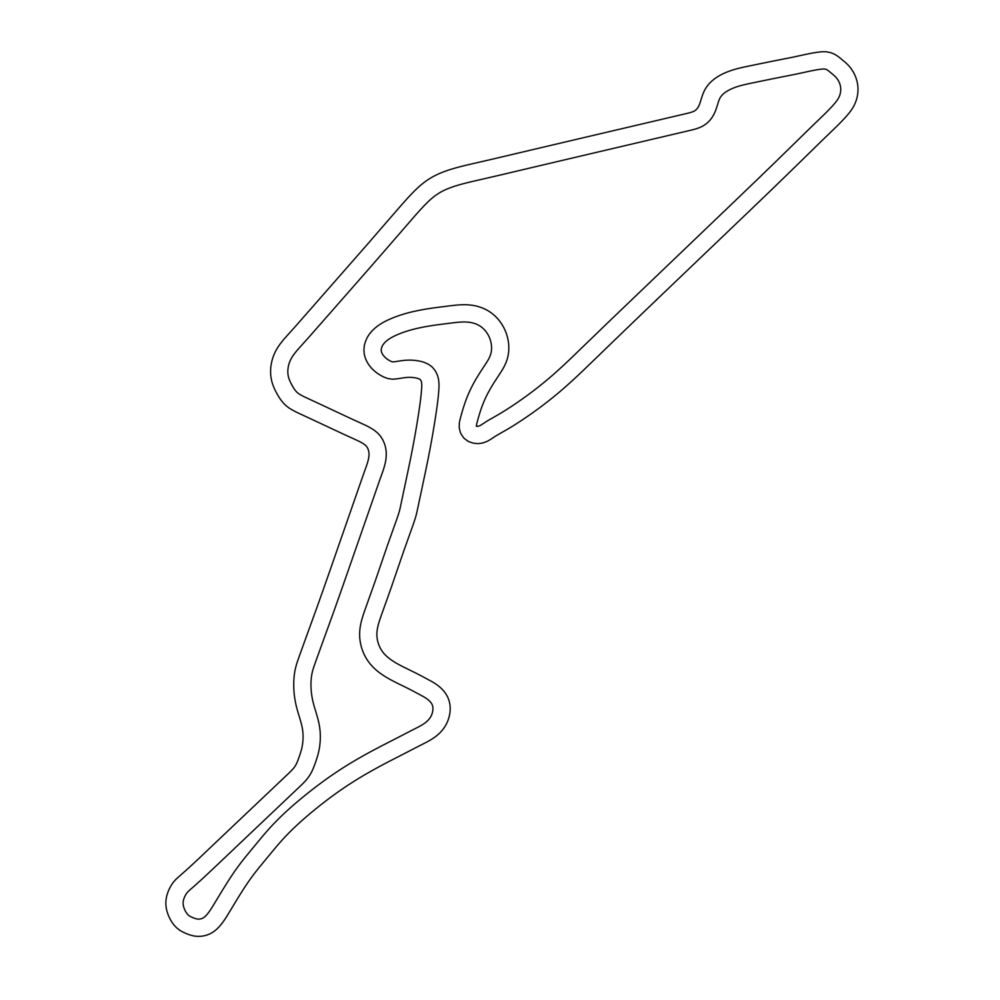
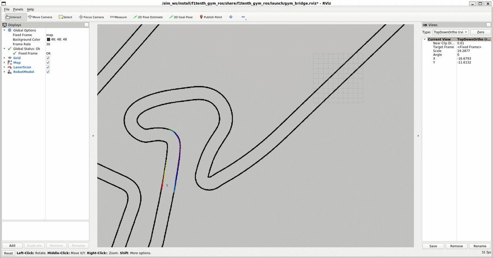
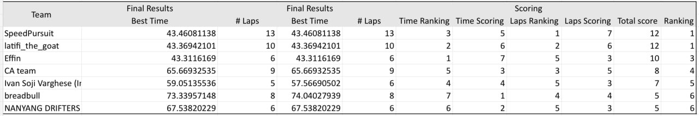

# Gap Follower (Dynamic)

This repository contains a ROS2 Python controller in `gap_finder_template.py` that implements a Follow-the-Gap style planner and adds racing-oriented logic for **DRS straights**, **warm-up lap mapping**, and **physics-based predictive braking**.

Track: [Nuerburgring](https://github.com/f1tenth/f1tenth_racetracks/tree/main/Nuerburgring)

Team: Ivan Soji Varghese (Individual)

Result: 5th place out of 7 teams

## What's different in `gap_finder_template.py`

### 1 Warm-up lap mapping (turn + straight logging)
- **Lap detection** uses `/ego_racecar/odom`:
  - Records a `start_position` on the first odometry message.
  - Counts a lap when the car returns within `LAP_TRIGGER_RADIUS` (1.5 m) after traveling at least `MIN_LAP_DISTANCE` (30 m).
- **Straight sections** are detected from steering history (`abs(steer) < STEERING_THRESHOLD`), and then analyzed to create **auto DRS zones**.
- **Turns** are logged during the warm-up lap only (`lap_count < 1`) using a more sensitive threshold (`TURN_DETECT_THRESHOLD`). Each logged turn stores:
  - ODO span (`from_m`, `to_m`), apex location, entry/apex/exit XY
  - peak/mean steering
  - estimated turn radius using $R = \frac{L}{\tan(\delta)}$ (wheelbase-based)

### 2 Auto DRS zones (straight detection + start/finish pairing)
- DRS zones are built automatically from detected straights (time gate + distance gate).
- If a straight crosses the lap reset (ODO wraps), it is split and re-analyzed.
- There is explicit handling for a **start/finish straight split into two halves**:
  - The "tail" segment at the end of the lap is paired with the "head" segment at the beginning of the next lap.
  - Both halves share the same combined speed limit, and braking is disabled between the halves.

### 3 DRS speed shaping (spool + braking taper)
While inside a DRS zone (only after the warm-up lap completes), the node computes:
- `effective_max_speed`: ramps up on entry ("spool") and ramps down near the exit ("braking taper").
- `effective_lookahead` and `effective_fov`: expanded in DRS to see further/wider, but tapered back down before leaving the zone.

Additionally, on DRS straights only, lookahead is extended to a speed-based cap:
- `effective_lookahead ≈ max(base_lookahead, 2 × current_speed)`
- This is still tapered down as the zone exit approaches to avoid "looking past" the next corner.

### 4 Per-zone incident detection + adaptive speed limits (0.2 m/s steps)
Each DRS zone maintains its own `speed_limit` and adapts it over laps:
- **Clean pass:** increases zone speed limit by **+0.2 m/s** up to `DRS_BOOST_SPEED`.
- **Incident / wiggle detected:** immediately cuts speed by **−0.2 m/s** (never below base race speed) and freezes the zone from further increases.

Incidents are detected by counting steering sign reversals during a zone pass:
- "Normal" reversals use a small steering threshold; "big" reversals use a larger threshold.
- Either persistent oscillation or violent corrections can trigger the cut/freeze.

### 5 Physics-based predictive braking (turn log → brake before corner)
After the warm-up lap, the controller uses the logged turns to brake early:
- Finds the next upcoming (or current) logged turn within a forward lookahead window.
- Computes a safe cornering speed:
  $$v_{corner} = \sqrt{\mu g R}$$
  with a floor at the base race speed.
- Computes required braking distance:
  $$d = \frac{v_{now}^2 - v_{corner}^2}{2a}$$
- If the turn is within the braking distance, it blends the commanded speed down toward `v_corner`.

### 6 Turn-aware lookahead (reduces over-optimism near sharp turns)
To prevent the planner from "aiming too far through" tight corners, lookahead is restricted near upcoming turns:
- Sharp turns (small radius) push lookahead down toward the base lookahead.
- Gentle turns keep the current lookahead.
- A proximity blend starts before the turn entry so it changes gradually.

### 7 Disparity extender improvements (more stable, speed-aware)
The disparity extender in this template includes several stability improvements:
- Ignores fake disparities at the FOV boundary and obstacle bubble boundary.
- Uses an **article-correct** extension rule: extend only toward the farther side, overwriting with the closer distance, without overwriting points that are already closer.
- Scales the effective bubble width with lookahead (important when DRS increases lookahead).
- Adds a speed-based "reaction margin" (extra samples) derived from $v \cdot t_{reaction}$.

The max-gap target selection also uses a center-weighted average when a plateau exists, which reduces left/right "twitching" when the best gap is symmetric.

## Speed and stability notes from testing
- With `max_speed` set to **8.0 m/s** (the template default), the controller is typically stable for longer runs.
- When pushing to **9–10 m/s**, long-run stability can degrade (oscillation/wiggle, late braking, and higher sensitivity to small perception changes).

If you want to experiment above 8 m/s, do it incrementally and watch:
- DRS zone incident cuts/freezes (they're designed to self-limit zones that cause wiggle)
- Predictive braking behavior into the logged tightest turns
- Lookahead tapering near DRS exits and near sharp turns

## Key parameters to tune
All are ROS parameters declared in `gap_finder_template.py`:
- `max_speed`, `min_speed`
- `steering_gain`, `speed_gain`, `max_steering`
- `lookahead_distance`, `field_of_vision`
- `disparity_threshold`, `robot_width`, `obstacle_bubble_radius`

DRS-related (constants in code):
- `DRS_ENABLED`, `DRS_BOOST_SPEED`, `drs_braking_distance`, `drs_spool_distance`
- `STEERING_THRESHOLD`, `MIN_STRAIGHT_READINGS`

Predictive braking (constants in code):
- `CORNER_MU`, `CORNER_DECEL`

## Running
This node subscribes to:
- LiDAR: `/scan`
- Odometry: `/ego_racecar/odom`

And publishes:
- Drive commands: `/drive` (`ackermann_msgs/AckermannDriveStamped`)

How you launch it depends on your ROS2 workspace setup. Common options:
- Run directly as a script (after sourcing your ROS2 environment): `python3 gap_finder_template.py`
- Or integrate it into your existing ROS2 package/launch files.

## References

https://www.nathanotterness.com/2019/04/the-disparity-extender-algorithm-and.html

https://github.com/nvan21/F1Tenth-Autonomous-Racing/tree/main?tab=readme-ov-file
